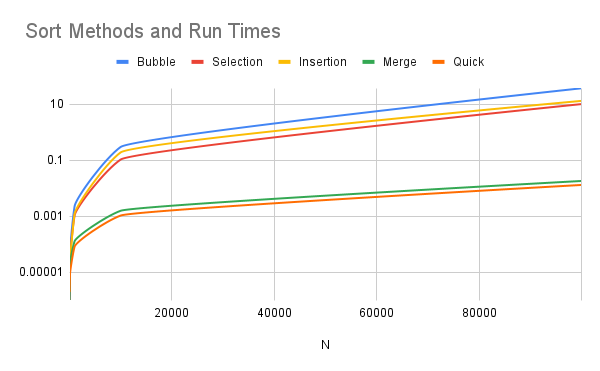

# Sort Analysis Data

## Results Table
Make sure to go out to at least 100,000 (more are welcome), and you have 10 different values (more welcome). You are welcome to go farther, but given 100,000 can take about 20 seconds using a selection sort on a fast desktop computer, and 200,000 took 77 seconds, you start having to wait much longer the more 0s you add. However, to build a clearer line, you will want more data points, and you will find merge and quick are able to handle higher numbers easier (but at a cost you will explore below). 

You are free to write a script to run the program and build your table (then copy that table built into the markdown). If you do that, please include the script into the repo.  Note: merge and quick sorts are going to be explored in the team activity for Module 06. You can start on it now, but welcome to wait.

 

### Table
| N | Bubble | Selection | Insertion | Merge | Quick |
| :-- | :--: | :--: | :--: | :--: | :--: |
|10|0.000001|0.000001|0.000000|0.000001|0.000002|
|100|0.000047|0.000028|0.000028|0.000018|0.000009|
|1000|0.002323|0.001095|0.001247|0.000131|0.000084|
|10000|0.302095|0.107404|0.193229|0.001593|0.001076|
|100000|37.534428|10.229813|13.328460|0.018416|0.013281|


## BigO Analysis  / Questions

### 1. Build a line chart
Build a line chart using your favorite program. Your X axis will be N increasing, and your Y access will be the numbers for each type of sort. This will create something similar to the graph in the instructions, though it won't be as smooth. Due to speed differences, you may need to break up the $O(\log n)$ and $\mathcal{O}(n^2)$in different charts.

Include the image in your markdown. As a reminder, you save the image in your repo, and use [image markdown].



### 2. Analysis
Looking at the graph and the table, what can you say about the various sorts? Which are the fastest? Which are the slowest? Which are the most consistent? Which are the least consistent? Use this space to reflect in your own words your observations.

Looking at the graph and the table: 
- The bubble sort, selection sort, and insertion sorts are the slowest
  - Among those bubble sort is the slowest, followed by insertion and selection. 
- The merge and quick sort are fastest, with the quick sort being slightly faster. 

### 3. Big O
Build another table that presents the best, worst, and average case for Bubble, Selection, Insertion, Merge, and Quick. You are free to use resources for this, but please reference them if you do. 

| Method    | Best                  | Worst                 | Average               |
| :--       | :--:                  | :--:                  | :--:                  | 
| Bubble    | $\mathcal{O}(n)$      |  $\mathcal{O}(n^2)$   |  $\mathcal{O}(n^2)$   |
|Selection  |  $\mathcal{O}(n^2)$   |  $\mathcal{O}(n^2)$   |  $\mathcal{O}(n^2)$   |
|Insertion  | $\mathcal{O}(n)$      |  $\mathcal{O}(n^2)$   |  $\mathcal{O}(n^2)$   |
|Merge      |$\mathcal{O}(n\log n)$ |$\mathcal{O}(n\log n)$ | $\mathcal{O}(n\log n)$ |
| Quick     |$\mathcal{O}(n\log n)$ |  $\mathcal{O}(n^2)$   | $\mathcal{O}(n\log n)$ |

[1] [2] [3]

#### 3.2 Worst Case
Provide example of arrays that generate _worst_ case for Bubble, Selection, Insertion, Merge Sorts

- Bubble: `[5, 4, 3, 2, 1]`
- Selection: `[5, 4, 3, 2, 1]`
- Insertion: `[5, 4, 3, 2, 1]`
- Merge: `[5, 1, 7, 3, 6, 2, 8, 4]` 

[1] [4]

#### 3.3 Best Case
Provide example of arrays that generate _best_ case for Bubble, Selection, Insertion, Merge Sorts 

- Bubble: `[1, 2, 3, 4, 5]`
- Selection: `[1, 2, 3, 4, 5]`
- Insertion: `[1, 2, 3, 4, 5]`
- Merge: `[1, 2, 3, 4, 5]` (same as worst)

[1] [4]

#### 3.4 Memory Considerations
Order the various sorts based on which take up the most memory when sorting to the least memory. You may have to research this, and include the mathematical notation. 

| Sort Method   | Space Complexity  |
| :--           | :--:              |
| Bubble        | $\mathcal{O}(1)$ |
| Selection     | $\mathcal{O}(1)$ |
| Insertion     | $\mathcal{O}(1)$ |
| Merge         | $\mathcal{O}(n)$ |
| Quick         | Worst: $\mathcal{O}(n)$ Best: $\mathcal{O}(\log n)$ |

[1] [4]

### 4. Growth of Functions
Give the following values, place them correctly into *six* categories. Use the bullets, and feel free to cut and paste the full LatexMath we used to generate them.  

#### Categories
* Constant: $\mathcal{O}(1)$ 
  * $10000$  
  * $100$  

* Linear: $\mathcal{O}(n)$ 
  * $3n$    
  * $100n$  

* Logarithmic: $\mathcal{O}(n \log n)$ 
  * $n\log_2n$  

* Quadratic: $\mathcal{O}(n^2)$ 
  * $n^2$  
  * $5n^2+5n$  

* Exponential: $\mathcal{O}(k^n)$ 
  * $2^n$  
  * $2^{(n-1)}$

* Factorial: $\mathcal{O}(n!)$ 
  * $n!$  


### 5. Growth of Function Language

Pair the following terms with the correct function in the table. 
* Constant, Logarithmic, Linear, Quadratic, Cubic, Exponential, Factorial

| Big $O$     |  Name       |
| ------      | ------      |
| $O(n^3)$    | Cubic       |
| $O(1)$      | Constant  |
| $O(n)$     | Linear  |
| $O(\log_2n)$ | Logarithmic  |
| $O(n^2)$     |Quadratic|
| $O(n!)$     | Factorial  |
| $O(2^n)$    | Exponential  |


### 6. Stable vs Unstable
Look up stability as it refers to sorting. In your own words, describe one sort that is stable and one sort that isn't stable  

-  A stable sort retains the original order in the array when elements in the array have the same value. For example, if the value `3` is at index position 2 and 4 in the original array, the `3` that was originally at index position 2 should be before the `3` that was originally at index position 4 in the sorted array. 

### 6.2 When stability is needed?
Explain in your own words a case in which you will want a stable algorithm over an unstable. Include an example. 

- A stable sort is important when you need to preserve the original order of the array. An example might be an array that is already sorted by one characteristic and then needs a second level of sorting -- imagine an array of product orders which was already ordered by timestamp. If you wanted to sort by product ID, the stable sort would keep the array ordered by timestamp within each product ID. 

### 7. Gold Thief

You are planning a heist to steal a rare coin that weighs 1.0001 ounces. The problem is that the rare coin was mixed with a bunch of counter fit coins. You know the counter fit coins only weight 1.0000 ounce each. There are in total 250 coins.  You have a simple balance scale where the coins can be weighed against each other. Hint: don't think about all the coins at once, but how you can break it up into even(ish) piles. 

- Break into two even groups; see which one weighs more; discard the other pile. 
- Repeat above until you find the coin. 

#### 7.1 Algorithm
Describe an algorithm that will help you find the coin. We encourage you to use pseudo-code, but not required.

```
Input: A list _A_ of _n_ elements
Output: The element with the maximum value

tempArray = []

while n > 1: 
  middle = n / 2
  A1 = A[0 to middle]
  A2 = A[middle + 1 to n]

  if(sum(A1) > sum(A2)): 
    tempArray = A1
  else: 
    tempArray = A2 
  n = middle
return tempArray;
```


#### 7.2 Time Complexity
What is the average time complexity of your algorithm? 

- The average time complexity would be logaritmic $\mathcal{O}(\log n)$, since n is being divided in a loop. 

## Technical Interview Practice Questions

For both these questions, are you are free to use what you did as the last section on the team activities/answered as a group, or you can use a different question.

1. Select one technical interview question (this module or previous) from the [technical interview list](https://github.com/CS5008-khoury/Resources/blob/main/TechInterviewQuestions.md) below and answer it in a few sentences. You can use any resource you like to answer the question.

- **What is the difference between stack and heap memory allocation and when would you use each?**

  - Stack allocation refers to memory assignment that happens during function calls, while heap allocation refers to dynamic memory allocation. Stack memory allocation is managed automatically and when the function finishes execution, memory is deallocated. Heap memory allocation, on the other hand persists for the entire execution of the program and must be managed by the programmer in C. 
  - Use stack allocation when the resource does not need to persist outside of the scope it's created in and use heap allocation when the resource needs to persist outside of that scope. 
  

1. Select one coding question (this module or previous) from the [coding practice repository](https://github.com/CS5008-khoury/Resources/blob/main/LeetCodePractice.md) and include a c file with that code with your submission. Make sure to add comments on what you learned, and if you compared your solution with others. 
 
- See `sort_array_by_parity.c`


## Deeper Thinking
Sorting algorithms are still being studied today. They often include a statistical analysis of data before sorting. This next question will require some research, as it isn't included in class content. When you call `sort()` or `sorted()` in Python 3.6+, what sort is it using? 

- Python uses Timsort.

#### Visualize
Find a graphic / visualization (can be a youtube video) that demonstrates the sort in action. 

- Great example here: https://www.chrislaux.com/timsort

#### Big O
Give the worst and best case time-complexity, and examples that would generate them. 

- Best case: $O(n)$ 
  - Already sorted: `[1, 2, 3, 4, 5, 6, 7, 8]`
- Worst cast: $O(n*log(n))$
  - Similar to merge sort, an array that will require lots of dividing/merging
  - `[5, 1, 7, 3, 6, 2, 8, 4]` 

<hr>

## References
Add your references here. A good reference includes an inline citation, such as [1] , and then down in your references section, you include the full details of the reference. Use [ACM Reference format].

1. GeeksforGeeks. "Comparison among Bubble Sort, Selection Sort and Insertion Sort." GeeksforGeeks DSA. https://www.geeksforgeeks.org/dsa/comparison-among-bubble-sort-selection-sort-and-insertion-sort/
2.  GeeksforGeeks. "Time and Space Complexity Analysis of Merge Sort." GeeksforGeeks DSA. https://www.geeksforgeeks.org/dsa/time-and-space-complexity-analysis-of-merge-sort/
3.  GeeksforGeeks. "Time and Space Complexity Analysis of Quick Sort." GeeksforGeeks DSA. https://www.geeksforgeeks.org/dsa/time-and-space-complexity-analysis-of-quick-sort/
4.  Baeldung. "Merge Sort Time Complexity." Baeldung Computer Science. https://www.baeldung.com/cs/merge-sort-time-complexity
5.  Chris Laux. "Timsort." Chris Laux Personal Website. https://www.chrislaux.com/timsort


## Footnotes:
[^note]: You will want at least 10 different N values, probably more to see the curve for Merge and Quick. If bubble, selection, and insertion start to take more than a  minute, you can say $> 60s$ or - . For example 
    | N | Bubble | Selection | Insertion | Merge | Quick |
    | :-- | :--: | :--: | :--: | :--: | :--: |
    | 10,000|0.197758|0.070548|0.000070|0.000513|0.000230|
    |100,000|-|-|-|0.131061|0.018602|

<!-- links moved to bottom for easier reading in plain text (btw, this a comment that doesn't show in the webpage generated-->
[image markdown]: https://docs.github.com/en/get-started/writing-on-github/getting-started-with-writing-and-formatting-on-github/basic-writing-and-formatting-syntax#images

[ACM Reference Format]: https://www.acm.org/publications/authors/reference-formatting
[IEEE]: https://www.ieee.org/content/dam/ieee-org/ieee/web/org/conferences/style_references_manual.pdf